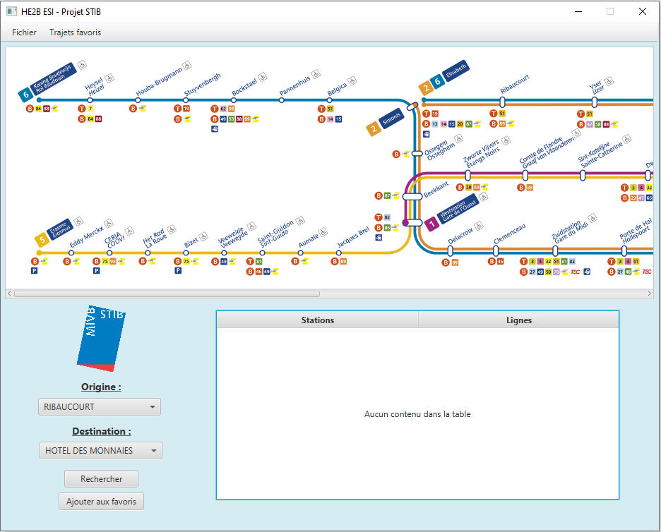
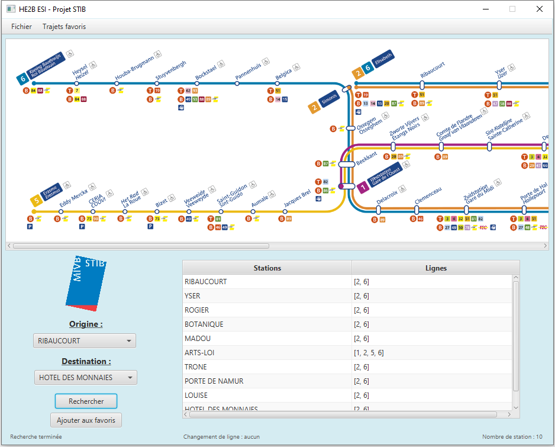

# StibRide: Metro Route Finder

## About the project

StibRide is a JavaFX application designed to help users find the shortest path between metro stations in the STIB (Société des Transports Intercommunaux de Bruxelles) network. Users can enter the origin and destination stations, initiate a search, and view the shortest path on the metro network map. The project uses the MVP (Model-View-Presenter) architecture and integrates a SQLite database containing the metro lines, stations, and stops. The application also supports the management of frequently used routes and allows users to save, modify, or delete their favorite trips.

## Key Features

- Origin and Destination Input: Users can select the origin and destination stations using a searchable dropdown (SearchableComboBox).
- Shortest Path Calculation: The application uses Dijkstra’s algorithm to compute the shortest route between two stations on the metro network.
- Metro Network Map: The interface includes a navigable map of the metro network, allowing users to visualize their route.
- Database Integration: The metro lines, stations, and stops are stored in a SQLite database, which is queried to construct the metro network as a graph.
- Favorite Routes Management:
  - Users can save frequent trips with a custom name (e.g., "Home to Work").
  - The application allows modifying and deleting saved routes.
- Error Handling: The interface shows error messages for invalid inputs or failed operations.
- Responsive and Interactive UI: Built using JavaFX, the UI allows for smooth interaction and displays search results in a table format.

## How to Run It

1. **Prerequisites:** Ensure you have JavaFX and Maven installed on your system.
2. Set up the SQLite database using the provided SQL script, which creates the following tables:
    - Lines: Contains the metro line numbers.
    - Stations: Contains all metro stations and their names.
    - Stops: Contains the stops on each line, with an order number indicating the stop's position on the line.
3. Clone the project repository
4. Run the Application:
    - From the Maven panel, go to the JavaFX section and double-click on javafx:run.
    - The application should open with the graphical interface, allowing you to search for routes between metro stations.

## Screenshots

